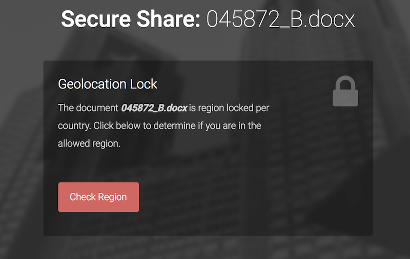

# GeoDoc
Convince user to reveal location information in order to access "region locked" document.




If the user accepts the HTML5 location request their GPS co-ordinates will be posted to the server. e.g:

```
➜  GeoDoc sudo python -m SimpleHTTPServer 80
Serving HTTP on 0.0.0.0 port 80 ...
127.0.0.1 - - [04/Feb/2018 19:40:35] "GET /geolock.html HTTP/1.1" 200 -
127.0.0.1 - - [04/Feb/2018 19:40:45] "GET /geoloc/38.951079529_-77.1406661046 HTTP/1.1" 404 -
```

If the user refuses (or device is unable) an error is shown. The download link on success points to 591af0b8c630d30b4093b90bf09bd662.docx, replace this with your own appropriate file.
